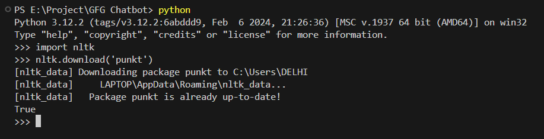
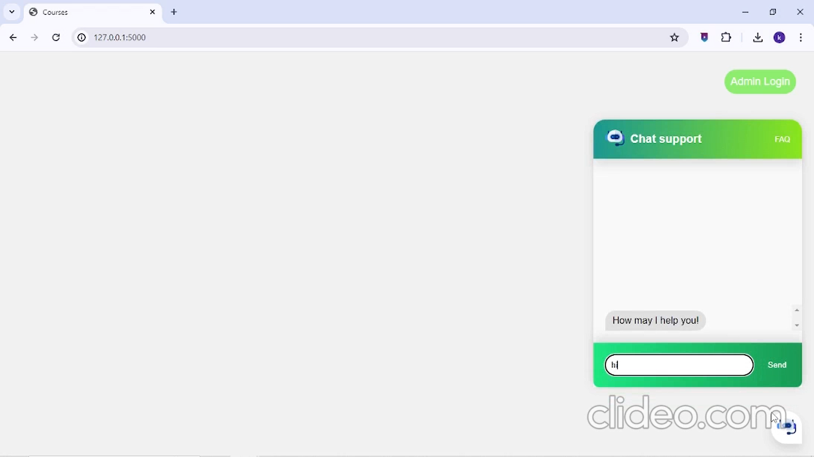
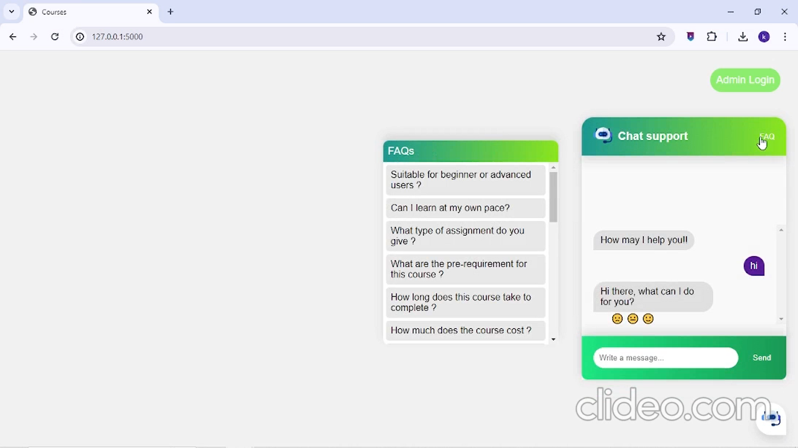
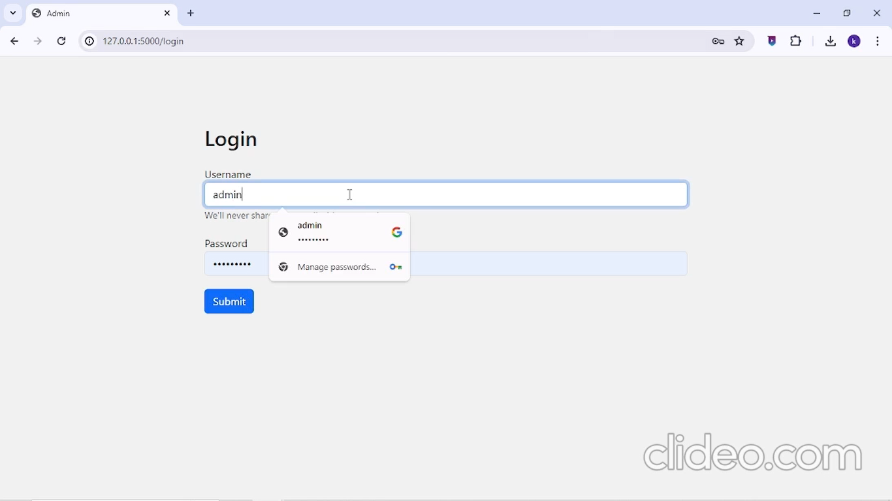
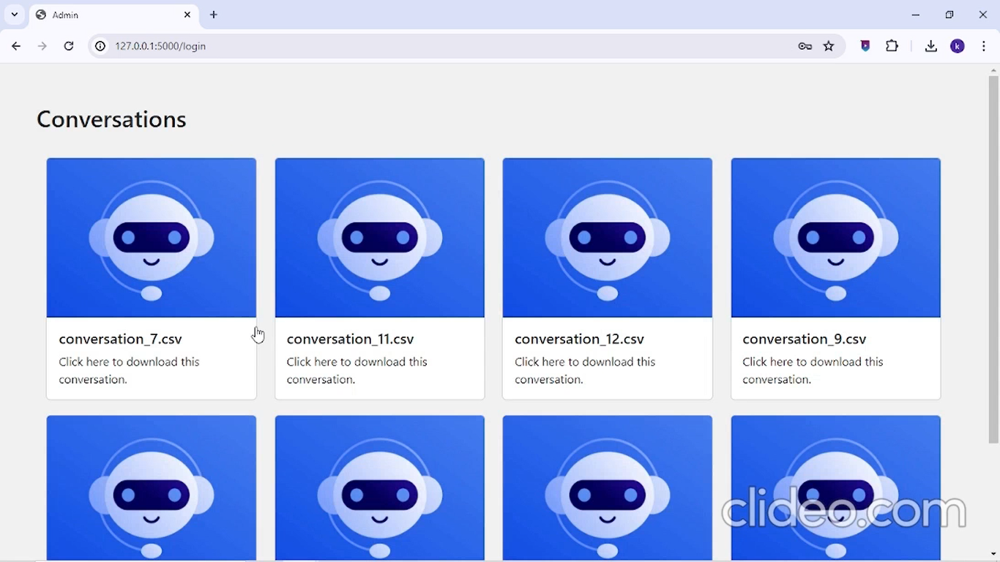
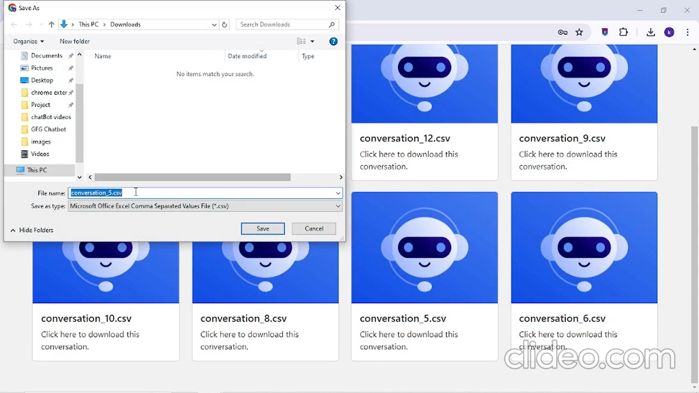
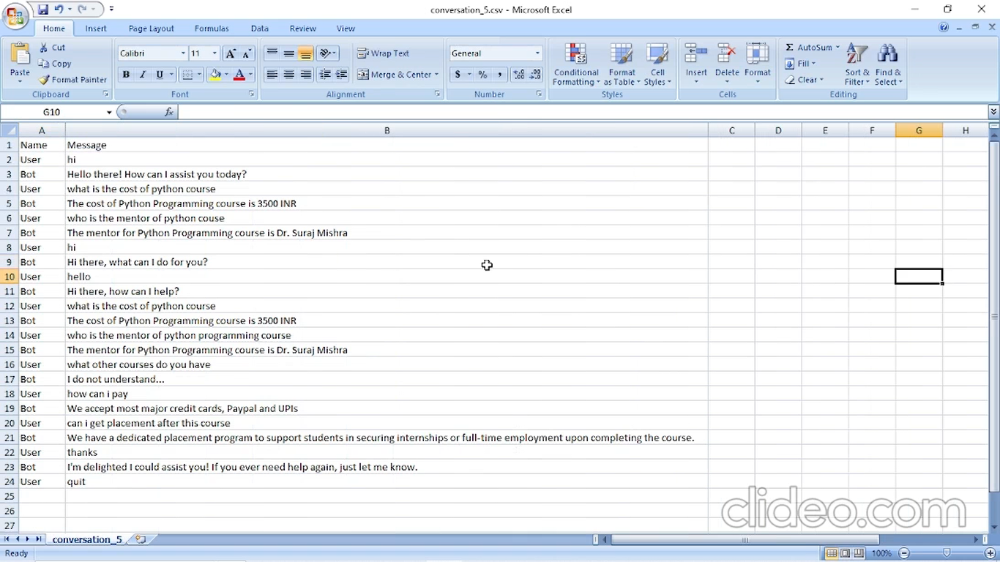

# Implementation of a Chatbot using Flask 

This Flask-based chatbot handles queries related to EdTech courses. Conversations with users are logged in CSV files and stored in Firebase, accessible by the marketing team and admin for future analysis and use.

## Key Features

### Chatbot
 A user-friendly chat bot where users can input their queries regarding courses.
### FAQ Integration
Integrated frequently asked questions (FAQs) related to courses.
### Natural Language Processing (NLP)
Utilized NLP techniques to understand user queries and extract key information required to provide relevant responses.
### Fallback to Doubt Assistant
If the query is not satisfied using FAQs database then chatbot will fallback to doubt assistant.
### User Satisfaction Feedback
After resolving a user query, chatbot prompts the user for feedback on their satisfaction level.
### Data Sharing with Sales Team
.csv file of every chat is shared to various teams.
### Performance Monitoring
Admin can monitor chatbot performance and can download .csv files from the server.


## Watch the Demo
[](https://youtu.be/vYRdGWGTQks)

## Installation

### Clone git repository
```bash
git clone https://github.com/crazykaran/chatbot.git
cd chatbot
```

### Create an environment
```console
pip install virtualenv
virtualenv venv
```

### Activate it
Mac / Linux:
```console
. venv/bin/activate
```
Windows:
```console
venv\Scripts\activate
```
### Install Dependencies


 ```console
pip install -r requirements.txt
 ```

If you get an error during the first run, you also need to install `nltk.tokenize.punkt`:
Run this once in your terminal:
 ```console
$ python
>>> import nltk
>>> nltk.download('punkt')
```

### Setup firebase
- Create a Firebase project and initialize storage and database.
- Generate a service account key and save it as `serviceAccountKey.json`.
- Update the Firebase configuration in the Flask application.

## Usage
Run
```console
python train.py
```
This will dump `data.pth` file. And then run
```console
python app.py
```
This will start a flask website

### Login Credentials:

username : admin

password : admin@123

## Images

### chatbot

### FAQs

### Admin Login

### Conversations .csv files

### Download .csv files

### Analyse .csv files

